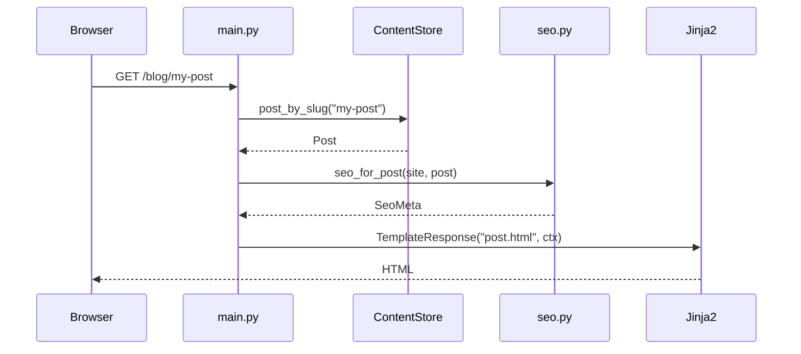

# Architecture

This document describes how Koji is structured for developers who want to contribute or fork the project.

## Design principles

1. **No database** — all content is files; the process is stateless aside from in-memory caches.
2. **Server-rendered HTML** — fast first paint, no React, minimal JavaScript (HTMX on blog search only).
3. **One site per instance** — no multi-tenancy; configuration is a single `site.yaml`.
4. **Content over code** — authors should rarely need to touch Python.

## Project layout

```
koji/
├── app/
│   ├── __init__.py          # version
│   ├── main.py              # FastAPI app, routes, lifespan
│   ├── config.py            # SiteConfig, load site.yaml
│   ├── content.py           # ContentStore, Post, Page, markdown render
│   ├── seo.py               # SeoMeta, sitemap, robots, JSON-LD helpers
│   ├── llms.py              # llms.txt / llms-full.txt generation
│   ├── static/
│   │   └── style.css
│   └── templates/
│       ├── base.html
│       ├── home.html, page.html, blog.html, post.html
│       └── partials/
│           ├── seo_head.html
│           └── post_list.html
├── content/                 # Your site (not framework code)
│   ├── site.yaml
│   ├── pages/
│   └── posts/
├── docs/                    # This documentation
├── tests/
├── Dockerfile
├── docker-compose.yml
└── requirements.txt
```

## Request flow



## Module responsibilities

### `app/config.py`

- Loads `content/site.yaml` into `SiteConfig` dataclass
- Resolves `KOJI_CONTENT_DIR`
- Detects `content/custom.css` → `has_custom_css`

### `app/content.py`

- **`ContentStore`:** loads and caches pages and posts
- **`Post` / `Page`:** dataclasses with rendered HTML and raw markdown
- **Markdown:** Python-Markdown with fenced code, codehilite, tables
- **Frontmatter:** `python-frontmatter` parses YAML headers

Key methods:

| Method | Returns |
|--------|---------|
| `published_posts()` | Non-draft posts, newest first |
| `post_by_slug(slug)` | Single post or None |
| `page(slug)` | Single page or None |
| `recent_posts(limit)` | For homepage |
| `popular_posts()` | From config or `popular` flag |
| `search_posts(query)` | Title/description filter |
| `reload()` | Clear caches |

### `app/seo.py`

- **`SeoMeta`:** title, description, canonical, OG, robots, JSON-LD list
- **`seo_for_*`:** builders per page type
- **`render_sitemap_xml(store)`**
- **`render_robots_txt(site)`**
- **`absolute_url(site, path)`**

### `app/llms.py`

- **`render_llms_txt(store)`** — spec-formatted index or static file
- **`render_llms_full_txt(store)`** — concatenated markdown
- **`format_page_markdown` / `format_post_markdown`**

### `app/main.py`

- FastAPI `app` with `lifespan` → warms `ContentStore` on startup
- HTML routes → `TemplateResponse` with `_ctx(seo=..., ...)`
- Feed, robots, sitemap, llms, `.md` exports → plain `Response`
- Static files mounted at `/static`

## Caching model

| Data | Cached? | Invalidation |
|------|---------|--------------|
| `site.yaml` | Yes | Dev: auto-reload on save; production: restart |
| Posts list | Yes, first access | Dev: auto-reload on save; production: restart |
| Pages dict | Yes, first access | Dev: auto-reload on save; production: restart |

In development, middleware in `app/reload.py` checks `content/` mtimes and calls `ContentStore.reload()` when files change. Set `KOJI_ENV=production` to skip this (Docker Compose sets it). Uvicorn `--reload` still only watches Python files.

## Template inheritance

```
base.html
  ├── seo partial (if seo in context)
  ├── header (site.title, nav)
  ├── 
  └── footer
```

Child templates only fill `` (and optionally `scripts` for HTMX on blog).

## Testing

| File | Covers |
|------|--------|
| `tests/test_integration.py` | Routes, HTML, feeds |
| `tests/test_seo.py` | Meta tags, sitemap, robots |
| `tests/test_llms.py` | llms.txt, markdown exports |

Tests use `fastapi.testclient.TestClient` with `pytest.ini` setting `pythonpath = .`.

## Dependencies

| Package | Role |
|---------|------|
| fastapi | Web framework |
| uvicorn | ASGI server |
| jinja2 | Templates |
| markdown | Render content |
| python-frontmatter | YAML headers in `.md` |
| pyyaml | `site.yaml` |
| pygments | Syntax highlighting (via codehilite) |

HTMX is loaded from CDN only on `/blog` (not a Python dependency).

## Extension points (summary)

| Extension point | File |
|-----------------|------|
| Routes | `app/main.py` |
| Content model | `app/content.py` |
| SEO behavior | `app/seo.py` |
| LLM exports | `app/llms.py` |
| HTML layout | `app/templates/*` |
| Default styles | `app/static/style.css` |
| User styles | `content/custom.css` |
| Site data | `content/site.yaml` |

## Performance characteristics

- **Cold request:** read from memory (after first load), render template
- **No I/O per request** for content after cache warm
- **Suitable for** personal blogs on a single small VPS
- **Bottleneck:** template render + markdown only on cache miss

## Versioning

`app/__version__` is exposed at `/health` and in FastAPI app metadata.

## Next

- [Extending Koji](extending.md) — practical recipes
- [Getting started](getting-started.md) — user-facing setup
