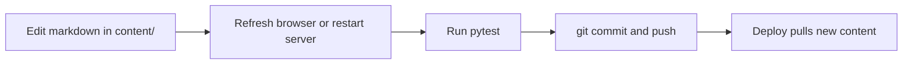

# Getting started

This guide walks you from zero to a running Koji site with your own content.

## Prerequisites

- **Python 3.11+** (3.12 recommended)
- **git** (to version your content)
- A text editor

Optional: Docker, if you prefer containerized deploys.

## 1. Clone and install

```bash
git clone https://github.com/your-org/koji.git
cd koji

python3 -m venv .venv
source .venv/bin/activate   # Windows: .venv\Scripts\activate

pip install -r requirements.txt
```

## 2. Run the dev server

```bash
uvicorn app.main:app --reload --host 127.0.0.1 --port 8000
```

Open [http://127.0.0.1:8000](http://127.0.0.1:8000). You should see the sample site (“Alex's blog”).

The `--reload` flag restarts the server when **Python code** changes. After editing markdown in `content/`, refresh the browser. If you change `site.yaml`, restart the server (reload does not always pick up YAML changes reliably).

## 3. Make it yours

### Edit site identity

Open `content/site.yaml` and change at minimum:

```yaml
title: "Your Name's blog"
author: Your Name
tagline: What you do in one sentence.
email: you@example.com
url: http://localhost:8000   # change to https://yourdomain.com before launch
powered_by: true               # please leave on if you can — see docs/attribution.md
```

### Edit the homepage

Open `content/pages/home.md`. The body is markdown rendered on `/`. Example:

```markdown
---
title: Home
description: Short summary for search engines.
---

# Hi I'm Your Name.

**I build things and write about them.**

A paragraph about what you do and where you are.
```

The `description` in frontmatter feeds SEO meta tags on the home page.

### Add a blog post

Create `content/posts/hello-world.md`:

```markdown
---
title: Hello, world
slug: hello-world
date: 2026-06-02
description: My first post on Koji.
---

Your post content here. Markdown works: **bold**, [links](https://example.com), code blocks, lists.

```python
print("hello")
```
```

Visit `/blog/hello-world`. It also appears under “My most recent posts” on the home page.

## 4. Understand the default pages

| File | URL | Purpose |
|------|-----|---------|
| `content/pages/home.md` | `/` | Intro + recent/popular post lists |
| `content/pages/projects.md` | `/projects` | Projects and work |

You can rewrite these entirely. Keep the filenames unless you [extend routes](extending.md).

## 5. Run tests (optional)

```bash
pip install -r requirements-dev.txt
pytest
```

All tests should pass. This confirms your environment matches what CI expects.

## 6. Deploy

When you're ready for production, read [Deployment](deployment.md). Before going live:

1. Set `url` in `site.yaml` to your real domain (HTTPS).
2. Replace example email and social handles.
3. Follow the [SEO launch checklist](seo.md#launch-checklist).

## Typical workflow



For Docker deploys with a volume mount on `content/`, you can update posts by pushing to git and pulling on the server — no image rebuild required for content-only changes.

## Next steps

- [Configuration](configuration.md) — all `site.yaml` keys
- [Content guide](content.md) — frontmatter, drafts, popular posts
- [Theming](theming.md) — `custom.css` and visual tweaks
- [Deployment](deployment.md) — Docker and production hosting
